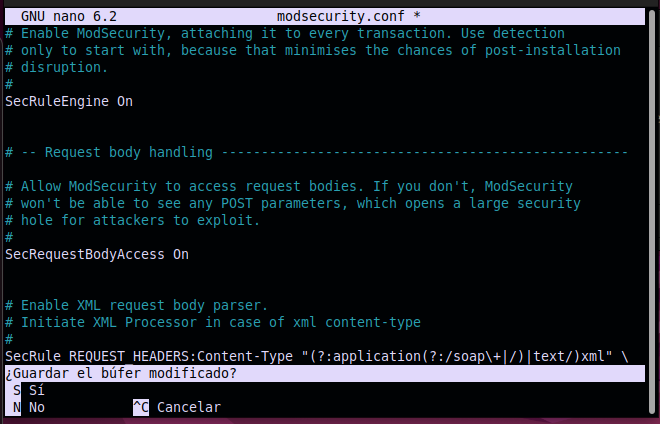

# Configuraciones Servidor Apache

## Instalacion de WAF a servidor Apache

### Instalacion Mod-Security

#### Paso1 - Instalar mod-security

```bash
sudo apt install libapache2-mod-security2
```

#### Paso2 - Habilite el módulo

```bash
sudo a2enmod security2
```

#### Paso3 - Copiar el archivo de configuración predeterminado de ModSecurity, modsecurity.conf-recommended a modsecurity.conf

```bash
sudo cp /etc/modsecurity/modsecurity.conf-recommended /etc/modsecurity/modsecurity.conf
```

#### Paso4 - Accedemos a la Siguiente Ruta

```bash
cd /etc/modsecurity
```

#### Paso5 - Clonamos el repositorio de OWASP

```bash
sudo git clone https://github.com/SpiderLabs/owasp-modsecurity-crs.git
```

#### Paso6 - Movemos el archivo de configuracion crs-setup.conf y lo renombramos

```bash
sudo mv owasp-modsecurity-crs/crs-setup.conf.example owasp-modsecurity-crs/crs-setup.conf
```

#### Paso7 - Modificamos el archivo modsecurity.conf

```bash
sudo nano modsecurity.conf
```

##### Buscar la linea *SecRuleEngine DetectionOnly* y Establézcalo en *SecRuleEngine On*



#### Paso8 - Reiniciamos el Servidor Apache

```bash
sudo systemctl restart apache2
sudo service apache2 restart
```

<br>

## instalacion Mod Evasive

```bash
sudo apt-get install libapache2-mod-evasive
```

### Habilitamos mod evaisve

```bash
sudo a2enmod evasive
```

### Habilitamos confi

```bash
sudo nano /etc/apache2/mods-enabled/evasive.conf
```

### Habilitamos confis

```bash
systemctl restart apache2
```

## Instalacion de wafw00f

### Instalación

```bash
sudo apt install wafw00f
```

### Pruebas

```bash
wafw00f tudominio o ip
```
